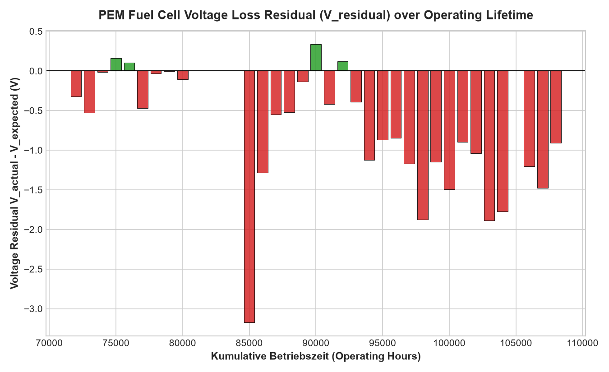
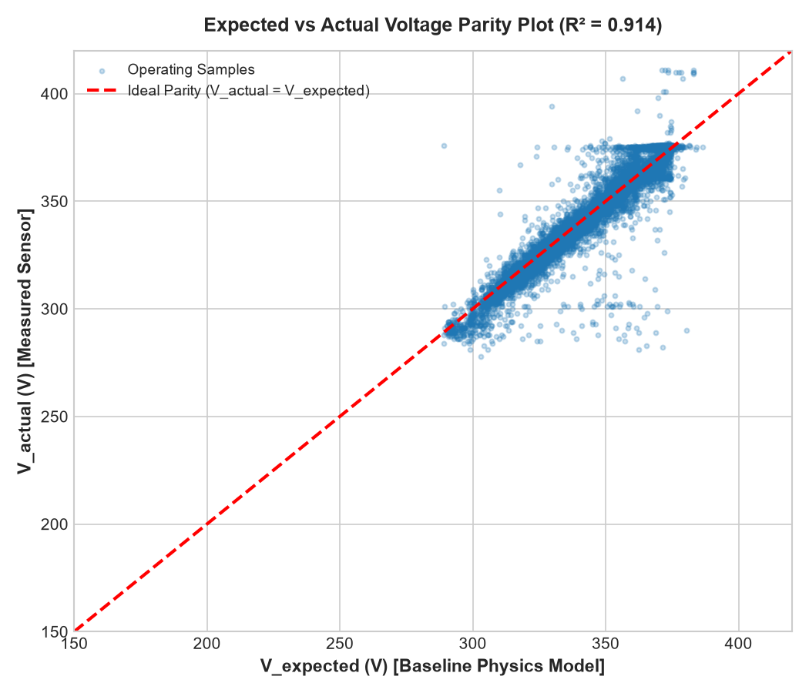

# PEM Fuel Cell Time Series Analytics & Degradation Dataset

[](https://www.python.org/)
[](LICENSE)
[-brightgreen.svg)]()

A comprehensive analytical pipeline, defensible health indicator (HI) degradation modeling suite, and technical reporting repository for vehicle-level Proton Exchange Membrane (PEM) Fuel Cell time-series telemetry.

---

## 📌 Project Overview

This repository processes and analyzes **302,212 time-series observations** recorded from an operating heavy-duty PEM Fuel Cell vehicle over a **701.21-day span** (August 2024 to July 2026). The dataset tracks multi-physics system dynamics across electrical performance, thermal dissipation, reactant air supply, vehicle kinematics, and stack degradation over operating hours (`Kumulative Betriebszeit h`).

---

## 🛠️ Complete Summary of Work Done (Step-by-Step)

### Phase 1: Dataset Exploration & Data Ingestion
- Loaded and parsed 25.69 MB of raw telemetry data ([raw_dataset.csv](raw_dataset.csv)).
- Validated UTC timestamp ordering, calculated total operational span (**701.21 days** / 16,829 hours), and established nominal sampling rate (**4.0 seconds** median).

### Phase 2: Modular Pipeline Engineering
Designed and implemented an automated, 4-step Python processing pipeline under [`scripts/`](scripts/):
1. **[step01_analyze_dataset.py](scripts/step01_analyze_dataset.py)**: Statistical profiling, missing data calculation, power derivation ($P = V \times I$), coolant temperature differential ($\Delta T$), and integrated energy output.
2. **[step02_deep_analysis.py](scripts/step02_deep_analysis.py)**: Time-series gap segmentation, Pearson correlation matrix computation, polarization curve binned modeling, and sensor anomaly detection.
3. **[step03_generate_charts.py](scripts/step03_generate_charts.py)**: Renders high-resolution vector/PNG visual charts.
4. **[step04_health_indicator.py](scripts/step04_health_indicator.py)**: Trains baseline regression model $V_{\text{expected}} = f(I, T_{\text{coolant}}, T_{\text{air}}, \text{Airflow}, \text{Ambient})$ on fresh state ($\le 76,000\text{ h}$), calculates residual voltage $V_{\text{residual}} = V_{\text{actual}} - V_{\text{expected}}$, and evaluates State of Health ($\text{SoH} \%$) over operating lifetime.
5. **[run_pipeline.py](scripts/run_pipeline.py)**: Master pipeline orchestrator that runs all 4 steps sequentially in **~6.0 seconds**.

### Phase 3: Defensible Health Indicator (HI) & Voltage Loss Degradation Modeling
- **Baseline Physics Regressor**: Built a non-linear gradient-boosted regressor fitting baseline expected voltage ($R^2 = 0.9144$, $\text{MAE} = 3.29\text{ V}$) during fresh operating hours.
- **Residual Loss Index**: Calculated $V_{\text{residual}} = V_{\text{actual}} - V_{\text{expected}}$.
  - $V_{\text{residual}} \approx 0\text{ V} \implies \text{SoH} = 100\%$ (Fresh expected stack behavior).
  - $V_{\text{residual}} < 0\text{ V} \implies \text{SoH} < 100\%$ (Irreversible voltage loss under identical load & environmental conditions).
- **Lifetime Degradation Trajectory**: Tracked $V_{\text{residual}}$ and $\text{SoH} \%$ across `Kumulative Betriebszeit h` (71,492 h to 108,112 h), establishing a defensible degradation index for synthetic data generation.

### Phase 4: Subsystem Diagnostics & Data Quality Audit
- **Electrical & Polarization Dynamics**: Derived polarization voltage drops ($V$ vs $I$) and power delivery curve ($P$ vs $I$) up to **80.96 kW peak power**.
- **Thermal Subsystem**: Modeled coolant inlet ($54.7\text{ °C}$ mean) vs. outlet ($56.7\text{ °C}$ mean) heat rise and air compressor motor thermal load (peaks up to $138\text{ °C}$).
- **Operating Load Regimes**: Segmented stack operations into Idle/Off (35.6%), Low Load (31.6%), Medium Load (28.2%), and High Load (4.5%).
- **Drive Session Segmentation**: Inter-sample gap algorithm ($> 300\text{ s}$ gap) identified **811 distinct driving sessions** (median length: 12.5 minutes).
- **Anomaly Detection**: Flagged **1,850 rows** of invalid negative voltages (-500 V) during shutoff and transient CAN-bus temperature drops (-50 °C).

### Phase 5: Technical Reporting & Visualizations
- Updated **[pem_cell_raw_dataset_analysis_report.md](pem_cell_raw_dataset_analysis_report.md)** and **[pipeline_audit_trail.md](pipeline_audit_trail.md)**.
- Generated diagnostic figures:
  - `health_degradation_curve.png`: State of Health (SoH %) vs Operating Hours (`Kumulative Betriebszeit h`).
  - `voltage_residual_over_hours.png`: Voltage Loss Residual ($V_{\text{actual}} - V_{\text{expected}}$) over operating lifetime.
  - `v_expected_vs_actual.png`: Expected vs Actual Voltage regression parity scatter plot.
  - `polarization_curve.png`: Dual-axis $V-I$ and $P-I$ polarization curve.
  - `operating_regimes.png`: Operational load regime pie chart.
  - `correlation_matrix.png`: Annotated 10x10 Pearson correlation heatmap.
  - `sample_drive_session.png`: 65-minute drive cycle multi-channel telemetry view.

---

## 📊 Visual Telemetry & Health Indicator Summary

| Defensible Health Degradation Curve | Voltage Loss Residual ($V_{\text{residual}}$) over Lifetime |
| :---: | :---: |
|  |  |

| Expected vs Actual Voltage Parity | Polarization & Power Curve |
| :---: | :---: |
|  |  |

---

## 📁 Repository Structure

```
.
├── README.md                              # Main project overview & guide
├── raw_dataset.csv                        # Raw input telemetry dataset (302,212 rows)
├── pem_cell_raw_dataset_analysis_report.md# Comprehensive technical analysis report
├── pipeline_audit_trail.md               # Backtesting audit trail & verification guide
├── health_degradation_curve.png           # Defensible SoH degradation curve figure
├── voltage_residual_over_hours.png        # Voltage residual figure
├── v_expected_vs_actual.png               # Baseline model parity scatter plot
├── polarization_curve.png                 # Polarization curve figure
├── operating_regimes.png                  # Operating regimes pie chart
├── correlation_matrix.png                 # Correlation matrix heatmap
├── sample_drive_session.png               # Drive session time-series chart
├── scripts/                               # Reproducible analytics pipeline
│   ├── step01_analyze_dataset.py          # Step 1: Profiling & summary statistics
│   ├── step02_deep_analysis.py            # Step 2: Session segmentation & polarization
│   ├── step03_generate_charts.py          # Step 3: Visual figure generator
│   ├── step04_health_indicator.py        # Step 4: Health Indicator & degradation model
│   └── run_pipeline.py                    # Master 4-step pipeline runner
└── outputs/                               # Output JSON summaries & figure copies
    ├── analysis_summary.json              # Statistical profile JSON output
    ├── deep_analysis.json                 # Deep time series & correlation JSON output
    ├── health_indicator_summary.json      # HI trajectory summary JSON
    ├── health_indicator_data.csv          # Binned hourly SoH data CSV
    └── *.png                              # Output figure copies
```

---

## 🚀 Quick Start & Installation

```bash
# Install dependencies
python -m pip install pandas numpy matplotlib scipy scikit-learn

# Run end-to-end 4-step analytics & health indicator pipeline
python scripts/run_pipeline.py
```

---

## 📈 Health Indicator Trajectory Metrics

| Operating Hours Bin | Mean $V_{\text{actual}}$ (V) | Mean $V_{\text{expected}}$ (V) | Residual $V_{\text{residual}}$ (V) | State of Health ($\text{SoH} \%$) | Status |
| :---: | :---: | :---: | :---: | :---: | :---: |
| **74,000 h** | 337.67 | 337.66 | 0.00 V | **100.00%** | Fresh Baseline |
| **76,000 h** | 342.26 | 342.16 | +0.10 V | **100.03%** | Fresh Baseline |
| **86,000 h** | 343.37 | 344.66 | -1.28 V | **99.63%** | Mild Loss |
| **94,000 h** | 343.68 | 344.91 | -1.23 V | **99.65%** | Moderate Loss |
| **100,000 h** | 342.22 | 343.77 | -1.54 V | **99.56%** | Moderate Loss |
| **103,000 h** | 341.29 | 343.17 | -1.88 V | **99.46%** | Degradation Trend |
| **107,000 h** | 342.61 | 344.06 | -1.45 V | **99.58%** | Aged State |

---

## 📄 License
This repository is released under the [MIT License](LICENSE).
