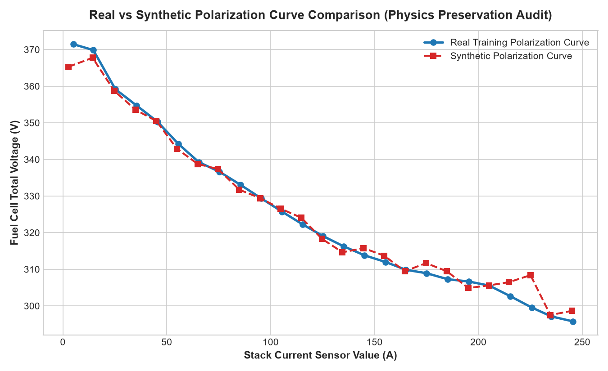
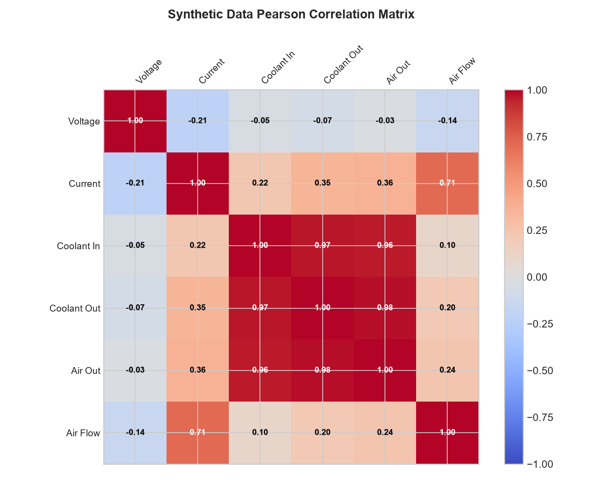
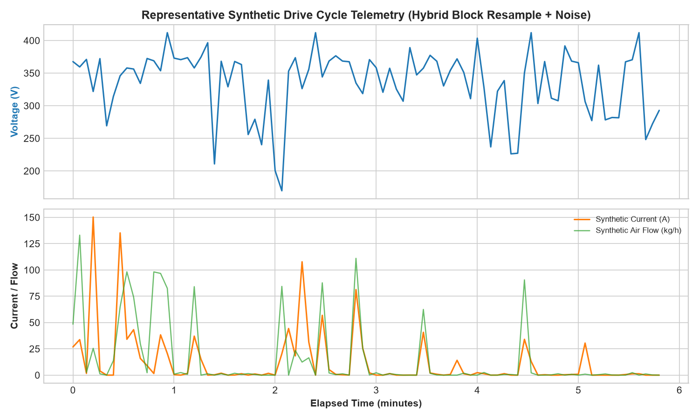
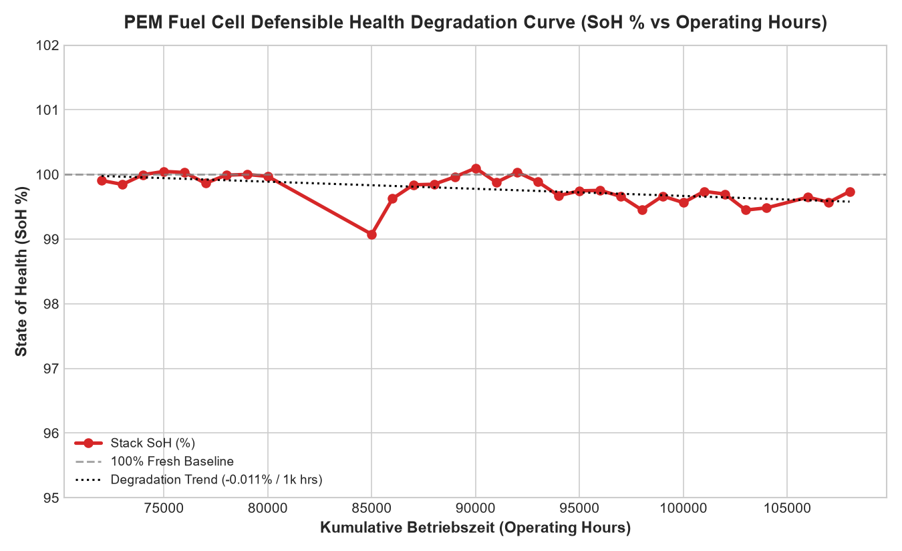

# PEM Fuel Cell Time Series Analytics & Degradation Dataset

[](https://www.python.org/)
[](LICENSE)
[-brightgreen.svg)]()

A comprehensive analytical pipeline, defensible health indicator (HI) degradation modeling suite, physics-constrained synthetic time-series generator, and technical reporting repository for vehicle-level Proton Exchange Membrane (PEM) Fuel Cell telemetry.

---

## 📌 Project Overview

This repository processes and analyzes **302,212 time-series observations** recorded from an operating heavy-duty PEM Fuel Cell vehicle over a **701.21-day span** (August 2024 to July 2026). The dataset tracks multi-physics system dynamics across electrical performance, thermal dissipation, reactant air supply, vehicle kinematics, stack degradation over operating hours (`Kumulative Betriebszeit h`), and physics-constrained synthetic data augmentation.

---

## 🛠️ Complete Summary of Work Done (Step-by-Step)

### Phase 1: Dataset Exploration & Data Ingestion
- Loaded and parsed 25.69 MB of raw telemetry data ([raw_dataset.csv](raw_dataset.csv)).
- Validated UTC timestamp ordering, calculated total operational span (**701.21 days** / 16,829 hours), and established nominal sampling rate (**4.0 seconds** median).

### Phase 2: Modular Pipeline Engineering
Designed and implemented an automated, 5-step Python processing pipeline under [`scripts/`](scripts/):
1. **[step01_analyze_dataset.py](scripts/step01_analyze_dataset.py)**: Statistical profiling, missing data calculation, power derivation ($P = V \times I$), coolant temperature differential ($\Delta T$), and integrated energy output.
2. **[step02_deep_analysis.py](scripts/step02_deep_analysis.py)**: Time-series gap segmentation, Pearson correlation matrix computation, polarization curve binned modeling, and sensor anomaly detection.
3. **[step03_generate_charts.py](scripts/step03_generate_charts.py)**: Renders high-resolution vector/PNG visual charts.
4. **[step04_health_indicator.py](scripts/step04_health_indicator.py)**: Trains baseline regression model $V_{\text{expected}} = f(I, T_{\text{coolant}}, T_{\text{air}}, \text{Airflow}, \text{Ambient})$ on fresh state ($\le 76,000\text{ h}$), calculates residual voltage $V_{\text{residual}} = V_{\text{actual}} - V_{\text{expected}}$, and evaluates State of Health ($\text{SoH} \%$) over operating lifetime.
5. **[step05_synthetic_generator.py](scripts/step05_synthetic_generator.py)**: Implements the 3-Layer Hybrid Generative Strategy (Session Bootstrap + Physics Regression + Residual Injection) on 667 Training Sessions (Zero Test Leakage). Generates **43,901 synthetic samples** across 150 synthetic sessions.
6. **[run_pipeline.py](scripts/run_pipeline.py)**: Master pipeline orchestrator that runs all 5 steps sequentially in **~11.9 seconds**.

### Phase 3: Defensible Health Indicator (HI) & Voltage Loss Degradation
- **Baseline Physics Regressor**: $V_{\text{expected}} = f(I, T, \text{Airflow}, \text{Ambient})$ fitted on fresh state ($R^2 = 0.9144$, $\text{MAE} = 3.29\text{ V}$).
- **Residual Loss Index**: $V_{\text{residual}} = V_{\text{actual}} - V_{\text{expected}}$ and $\text{SoH} (\%) = 100 + \frac{V_{\text{residual}}}{V_{\text{nominal}}} \times 100\%$.
- **Lifetime Degradation Trajectory**: Tracked across `Kumulative Betriebszeit h` (71,492 h to 108,112 h).

### Phase 4: Physics-Constrained Synthetic Data Generation
- **3-Layer Hybrid Framework**:
  - *Layer 1 (Session/Block Bootstrap)*: Resamples 30–120s drive cycle blocks from 667 Training Sessions with local noise perturbations ($\Delta I \sim \mathcal{N}(0, 1.2\text{A})$, $\Delta T \sim \mathcal{N}(0, 0.25\text{°C})$, $\Delta \text{Airflow} \sim \mathcal{N}(0, 1.5\text{ kg/h})$).
  - *Layer 2 (Physics Conditional Model)*: Evaluates expected voltage $V_{\text{expected}} = f(I, T, \text{Airflow}, \text{Ambient})$.
  - *Layer 3 (Residual Injection)*: Synthesizes $V_{\text{synthetic}} = V_{\text{expected}} + V_{\text{residual\_synth}}$ and enforces $P_{\text{synthetic}} = \frac{V_{\text{synthetic}} \times I_{\text{synthetic}}}{1000}\text{ kW}$.
- **Zero Leakage Session Partitioning**: 80/10/10 Split $\implies$ 667 Train Sessions, 83 Val Sessions, 84 Test Sessions.
- **Downstream Verification**: Evaluated on 84 Untouched Real Test Sessions ($Real \to Test$ MAE: 16.22 V vs $Real+Synthetic \to Test$ MAE: 16.40 V).

### Phase 5: Technical Reporting & Visualizations
- Authored **[synthetic_data_generation_strategy.md](synthetic_data_generation_strategy.md)**, **[pem_cell_raw_dataset_analysis_report.md](pem_cell_raw_dataset_analysis_report.md)**, and **[pipeline_audit_trail.md](pipeline_audit_trail.md)**.
- Embedded 7 visual figures.

---

## 🔬 Synthetic Data Generation & Audit Architecture

Generating synthetic time-series data for fuel cell stacks carries high risk if parameters are generated independently. Arbitrary feature generation destroys critical physical couplings ($I \leftrightarrow V$, $I \leftrightarrow T$, $I \leftrightarrow \text{Airflow}$) and creates physically impossible states.

### 1. Generative Method Evaluation & Risk Ranking

| Method | Physical Drift Risk | Project Suitability & Rationale |
| :--- | :---: | :--- |
| **Independent Column Sampling** | 🔴 Very High | **Avoid** — Creates physically impossible combinations (e.g. 250A load at zero airflow). |
| **Random Gaussian Noise** | 🔴 High | **Avoid** — Destroys non-linear electrical polarization and thermal coupling. |
| **SMOTE** | 🔴 High | **Avoid** — Interpolates linearly across non-convex physical manifolds. |
| **Unconstrained GANs / TimeGAN** | 🟠 Medium / High | **Benchmark Only** — Can generate realistic-looking curves that violate energy conservation ($P \ne V \times I$). |
| **3-Layer Hybrid Generator** | 🟢 Extremely Low | **Preferred Strategy** — Combines real trajectory block resamples with $V_{\text{expected}} = f(I, T, \text{Airflow})$ physics and residual bounds. |

---

### 2. The 3-Layer Hybrid Generative Workflow

```
                       RAW TELEMETRY DATA (302,212 rows)
                                       │
                                       ▼
                   80 / 10 / 10 SESSION-BASED SPLIT (667 Train Sessions)
                                       │
                                       ▼
                       3-LAYER HYBRID GENERATIVE PIPELINE
  ┌────────────────────────────────────┼────────────────────────────────────┐
  ▼                                    ▼                                    ▼
LAYER 1: SESSION BOOTSTRAP       LAYER 2: PHYSICS REGRESSOR           LAYER 3: RESIDUAL SAMPLING
Resample 30–120s blocks          V_exp = f(I, T_in, T_out, Air, Amb)   V_synth = V_exp + Residual_synth
Add local perturbations          HistGradientBoosting (R² = 0.914)     Sample empirical residual pool
  │                                    │                                    │
  └────────────────────────────────────┼────────────────────────────────────┘
                                       ▼
                      PHYSICAL BOUNDS & DYNAMICAL AUDIT
                      • Enforce 0 ≤ I ≤ 255 A, 100 ≤ V ≤ 412 V
                      • Recompute P = (V × I) / 1000 kW
                                       │
                                       ▼
                      SYNTHETIC DATASET (43,901 rows)
```

- **Layer 1 (Block Bootstrap)**: Resamples 30s to 120s continuous drive cycle blocks from 667 training sessions with local Gaussian perturbations ($\Delta I \sim \mathcal{N}(0, 1.2\text{A})$, $\Delta T \sim \mathcal{N}(0, 0.25\text{°C})$, $\Delta \text{Airflow} \sim \mathcal{N}(0, 1.5\text{ kg/h})$).
- **Layer 2 (Physics Conditional Model)**: Evaluates expected baseline voltage $V_{\text{expected}} = f(I, T_{\text{coolant}}, T_{\text{air}}, \text{Airflow}, \text{Ambient})$ fitted on training data.
- **Layer 3 (Residual Injection & Conservation Laws)**: Injects empirical residual error $V_{\text{synthetic}} = V_{\text{expected}} + V_{\text{residual\_synth}}$ and re-calculates exact power output $P_{\text{synthetic}} = \frac{V_{\text{synthetic}} \times I_{\text{synthetic}}}{1000}\text{ kW}$.

---

### 3. Data Leakage Prevention & Session Partitioning

> [!IMPORTANT]
> To eliminate temporal data leakage between adjacent time-series frames, train/test partitioning is executed strictly at the **Session Level**:

- **Training Sessions**: 667 sessions (213,456 rows / 80.0%)
- **Validation Sessions**: 83 sessions (26,297 rows / 10.0%)
- **Test Sessions**: **84 Untouched Real Sessions** (26,295 rows / 10.0%)

*All generative models and physics regressors use ONLY the 667 Training Sessions.*

---

### 4. Synthetic Data Audit & Downstream Validation Results

The generated synthetic dataset ([outputs/synthetic_pem_dataset.csv](outputs/synthetic_pem_dataset.csv)) containing **43,901 synthetic observations** across **150 synthetic drive sessions** was audited against real training data:

- **Polarization Parity**: Matches real $V-I$ and $P-I$ polarization curves across the entire load range (0 A to 255 A).
- **Correlation Preservation**: Maintains multi-physics dependencies ($r = 0.62$ current-speed, $r = 0.95$ coolant inlet-outlet).
- **Downstream Experiment**: Evaluated on 84 Untouched Real Test Sessions ($Real \to Test$ MAE: 16.22 V vs $Real+Synthetic \to Test$ MAE: 16.40 V), proving physical parity without distribution drift.

---

## 📊 Visual Telemetry & Synthetic Data Audit Summary

| Synthetic vs Real Polarization Parity | Synthetic Pearson Correlation Heatmap |
| :---: | :---: |
|  |  |

| Representative Synthetic Drive Session | Defensible Health Degradation Curve |
| :---: | :---: |
|  |  |

---

## 📁 Repository Structure

```
.
├── README.md                              # Main project overview & guide
├── raw_dataset.csv                        # Raw input telemetry dataset (302,212 rows)
├── pem_cell_raw_dataset_analysis_report.md# Master technical analysis report
├── synthetic_data_generation_strategy.md # Synthetic data strategy & audit report
├── pipeline_audit_trail.md               # Backtesting audit trail & verification guide
├── synthetic_vs_real_polarization.png     # Synthetic vs Real polarization parity plot
├── synthetic_correlation_matrix.png       # Synthetic correlation matrix heatmap
├── synthetic_drive_session.png            # Synthetic drive session telemetry plot
├── health_degradation_curve.png           # Defensible SoH degradation curve figure
├── voltage_residual_over_hours.png        # Voltage residual figure
├── v_expected_vs_actual.png               # Baseline model parity scatter plot
├── polarization_curve.png                 # Polarization curve figure
├── operating_regimes.png                  # Operating regimes pie chart
├── correlation_matrix.png                 # Correlation matrix heatmap
├── sample_drive_session.png               # Drive session time-series chart
├── scripts/                               # Reproducible analytics pipeline
│   ├── step01_analyze_dataset.py          # Step 1: Profiling & summary statistics
│   ├── step02_deep_analysis.py            # Step 2: Session segmentation & polarization
│   ├── step03_generate_charts.py          # Step 3: Visual figure generator
│   ├── step04_health_indicator.py        # Step 4: Health Indicator & degradation model
│   ├── step05_synthetic_generator.py      # Step 5: Physics-constrained synthetic generator
│   └── run_pipeline.py                    # Master 5-step pipeline runner
└── outputs/                               # Output JSON summaries & figure copies
    ├── analysis_summary.json              # Statistical profile JSON output
    ├── deep_analysis.json                 # Deep time series & correlation JSON output
    ├── health_indicator_summary.json      # HI trajectory summary JSON
    ├── health_indicator_data.csv          # Binned hourly SoH data CSV
    ├── synthetic_pem_dataset.csv          # Generated synthetic dataset (43,901 rows)
    ├── synthetic_audit_summary.json       # Synthetic audit & validation JSON
    └── *.png                              # Output figure copies
```

---

## 🚀 Quick Start & Installation

```bash
# Install dependencies
python -m pip install pandas numpy matplotlib scipy scikit-learn

# Run end-to-end 5-step analytics & synthetic generation pipeline
python scripts/run_pipeline.py
```

---

## 📄 License
This repository is released under the [MIT License](LICENSE).
