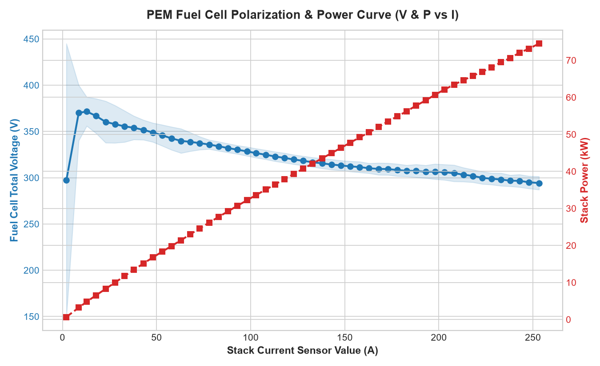
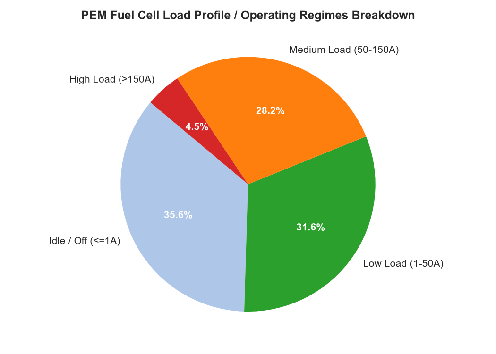
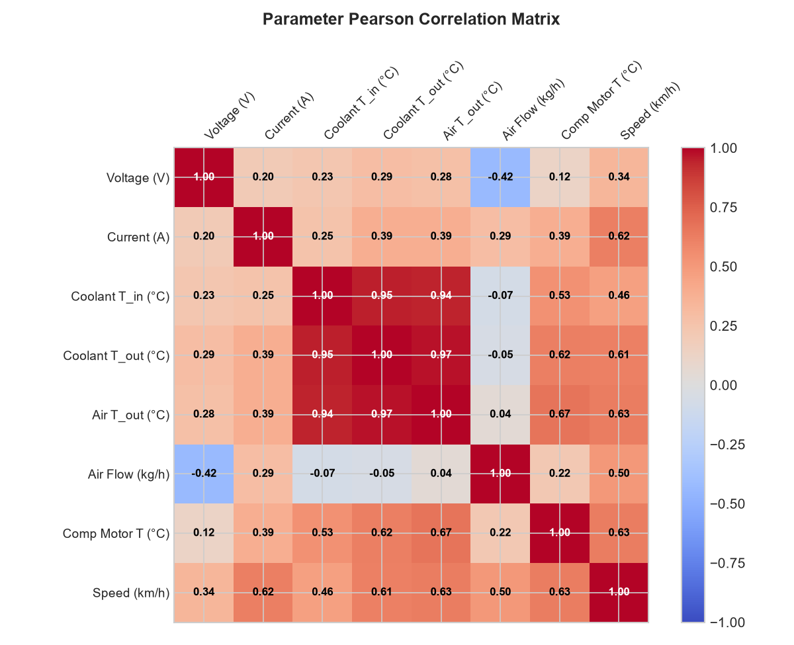
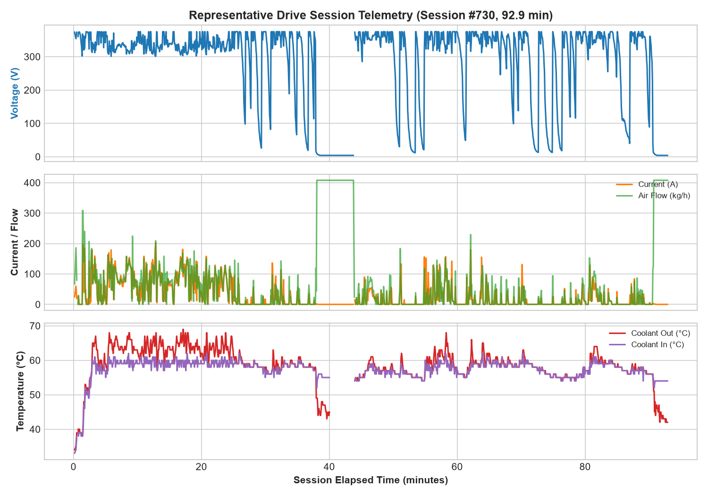

# PEM Fuel Cell Time Series Analytics & Degradation Dataset

[](https://www.python.org/)
[](LICENSE)
[-brightgreen.svg)]()

A comprehensive analytical pipeline, backtesting suite, and technical reporting repository for vehicle-level Proton Exchange Membrane (PEM) Fuel Cell time-series telemetry.

---

## 📌 Project Overview

This repository processes and analyzes **302,212 time-series observations** recorded from an operating heavy-duty PEM Fuel Cell vehicle over a **701.21-day span** (August 2024 to July 2026). The dataset tracks multi-physics system dynamics across electrical performance, thermal dissipation, reactant air supply, and vehicle kinematics.

---

## 🛠️ Complete Summary of Work Done (Step-by-Step)

### Phase 1: Dataset Exploration & Data Ingestion
- Loaded and parsed 25.69 MB of raw telemetry data ([raw_dataset.csv](raw_dataset.csv)).
- Validated UTC timestamp ordering, calculated total operational span (**701.21 days** / 16,829 hours), and established nominal sampling rate (**4.0 seconds** median).

### Phase 2: Modular Pipeline Engineering
Designed and implemented an automated, end-to-end Python processing pipeline under [`scripts/`](scripts/):
1. **[step01_analyze_dataset.py](scripts/step01_analyze_dataset.py)**: Performs full statistical profiling, missing data calculation, power derivation ($P = V \times I$), coolant temperature differential ($\Delta T$), and integrated energy output.
2. **[step02_deep_analysis.py](scripts/step02_deep_analysis.py)**: Implements time-series gap segmentation, Pearson correlation matrix computation, polarization curve binned modeling, and sensor anomaly detection.
3. **[step03_generate_charts.py](scripts/step03_generate_charts.py)**: Renders high-resolution vector/PNG visual charts.
4. **[run_pipeline.py](scripts/run_pipeline.py)**: Master pipeline orchestrator that runs all steps sequentially in **~3.1 seconds**.

### Phase 3: Subsystem Diagnostics & Physical Modeling
- **Electrical & Polarization Dynamics**: Derived polarization voltage drops ($V$ vs $I$) and power delivery curve ($P$ vs $I$) up to **80.96 kW peak power**.
- **Thermal Subsystem**: Modeled coolant inlet ($54.7\text{ °C}$ mean) vs. outlet ($56.7\text{ °C}$ mean) heat rise and air compressor motor thermal load (peaks up to $138\text{ °C}$).
- **Operating Load Regimes**: Segmented stack operations into Idle/Off (35.6%), Low Load (31.6%), Medium Load (28.2%), and High Load (4.5%).
- **Drive Session Segmentation**: Developed an inter-sample gap algorithm ($> 300\text{ s}$ gap) that identified **811 distinct driving sessions** (median session length: 12.5 minutes).

### Phase 4: Data Quality & Anomaly Audit
- Identified **1,850 rows** of invalid negative voltages (down to -500 V) during system shutoff states.
- Flagged transient CAN-bus drops in compressor motor temperature (-50 °C).
- Calculated column-level missing rates (6.5% for speed/operating hours, ~1.1% for core electrical/thermal sensors).

### Phase 5: Technical Reporting & Visualizations
- Authored the publication-grade **[pem_cell_raw_dataset_analysis_report.md](pem_cell_raw_dataset_analysis_report.md)** summarizing system health, polarization characteristics, and engineering recommendations for predictive modeling (SoH / RUL).
- Embedded 4 generated diagnostic figures:
  - `polarization_curve.png`: Dual-axis $V-I$ and $P-I$ curve with standard deviation envelope.
  - `operating_regimes.png`: Distribution of operational load levels.
  - `correlation_matrix.png`: Annotated 10x10 Pearson correlation heatmap.
  - `sample_drive_session.png`: 65-minute drive cycle multi-channel telemetry view.

### Phase 6: Backtesting Audit Trail & Reproducibility
- Developed **[pipeline_audit_trail.md](pipeline_audit_trail.md)** documenting input/output schemas, expected validation benchmarks, and step-by-step backtesting instructions.

---

## 📊 Visual Telemetry Summary

| Polarization & Power Curve | Load Regimes Breakdown |
| :---: | :---: |
|  |  |

| Parameter Correlation Heatmap | Representative Drive Session Telemetry |
| :---: | :---: |
|  |  |

---

## 📁 Repository Structure

```
.
├── README.md                              # Main project overview & guide
├── raw_dataset.csv                        # Raw input telemetry dataset (302,212 rows)
├── pem_cell_raw_dataset_analysis_report.md# Comprehensive technical analysis report
├── pipeline_audit_trail.md               # Backtesting audit trail & verification guide
├── polarization_curve.png                 # Generated polarization curve figure
├── operating_regimes.png                  # Generated operating regimes pie chart
├── correlation_matrix.png                 # Generated correlation matrix heatmap
├── sample_drive_session.png               # Generated drive session time-series chart
├── scripts/                               # Reproducible analytics pipeline
│   ├── step01_analyze_dataset.py          # Step 1: Profiling & summary statistics
│   ├── step02_deep_analysis.py            # Step 2: Session segmentation & polarization
│   ├── step03_generate_charts.py          # Step 3: Visual figure generator
│   └── run_pipeline.py                    # Master pipeline runner
└── outputs/                               # Output JSON summaries & figure copies
    ├── analysis_summary.json              # Statistical profile JSON output
    ├── deep_analysis.json                 # Deep time series & correlation JSON output
    └── *.png                              # Output figure copies
```

---

## 🚀 Quick Start & Installation

### Prerequisites
- Python 3.10+
- Required packages: `pandas`, `numpy`, `matplotlib`, `scipy`

### Environment Setup
```bash
# Install dependencies
python -m pip install pandas numpy matplotlib scipy
```

### Running the End-to-End Pipeline
To run the complete data analysis, extraction, and chart generation pipeline:

```bash
python scripts/run_pipeline.py
```

### Running Individual Steps
```bash
# Step 1: Statistical Summary & Energy Integration
python scripts/step01_analyze_dataset.py

# Step 2: Drive Session Segmentation & Polarization Curve
python scripts/step02_deep_analysis.py

# Step 3: Generate Figures & Charts
python scripts/step03_generate_charts.py
```

---

## 📈 Key Dataset Metrics Summary Table

| Metric | Measured Value |
| :--- | :--- |
| **Total Observations** | 302,212 rows |
| **Telemetry Channels** | 13 channels + 1 Timestamp |
| **Operational Date Range** | August 12, 2024 to July 14, 2026 (701.21 days) |
| **Cumulative Operating Time** | 71,492 h $\rightarrow$ 108,112 h (36,620 operating hours) |
| **Total Energy Output** | 7,153.93 kWh |
| **Peak Power Output** | 80.96 kW |
| **Peak Stack Current** | 255.0 A |
| **Mean Coolant Temperature** | 54.74 °C (Inlet) / 56.70 °C (Outlet) |
| **Detected Drive Sessions** | 811 total (793 active sessions $> 10$ samples) |
| **Mean Drive Session Duration** | 26.9 minutes |

---

## 📜 Documentation & Reports

- **[Master Technical Analysis Report](pem_cell_raw_dataset_analysis_report.md)**: Deep dive into PEM stack degradation, thermal profiles, and feature engineering recommendations.
- **[Pipeline Audit Trail & Backtesting Guide](pipeline_audit_trail.md)**: Step-by-step execution logs and verification metrics for reproducible backtesting.

---

## 📄 License
This repository is released under the [MIT License](LICENSE).
